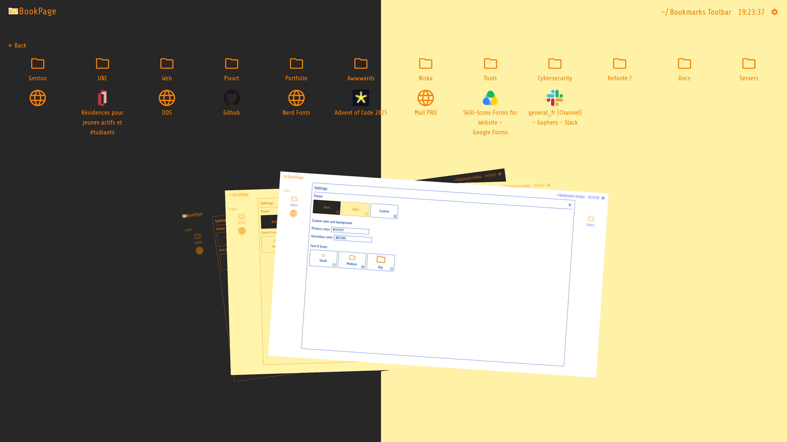

<p align="center"></p>
<h3 align="center">The extension to really see your bookmarks 🗂️ ✨</h3>
<hr />

# Docs

- [Docs](#docs)
- [Example](#example)
- [Install Extension](#install-extension)
    - [Chrome and Firefox](#chrome-and-firefox)
    - [Source](#source)
- [💖 Support the Project](#support-the-project)

# Example

<p align="center"></p>

# Install Extension

## Chrome and Firefox

The extension is still in progress. Once it becomes available on the Chrome Web Store and Firefox Add-ons, it will be possible to install it from there.
<!-- Install the Firfox extension [here](#). -->

<!-- ## Chrome -->

<!-- Install the Google Chrome extension [here](#). -->

## Source

```sh
git clone https://github.com/LelouchFR/book-page.git
cd book-page
npm install && npm run build
```

<h1 id="support-the-project">💖 Support the Project</h1>

Thank you so much already for using my project !

To support the project directly, feel free to open issues for problems you've encountered, or contribute with a pull request!
